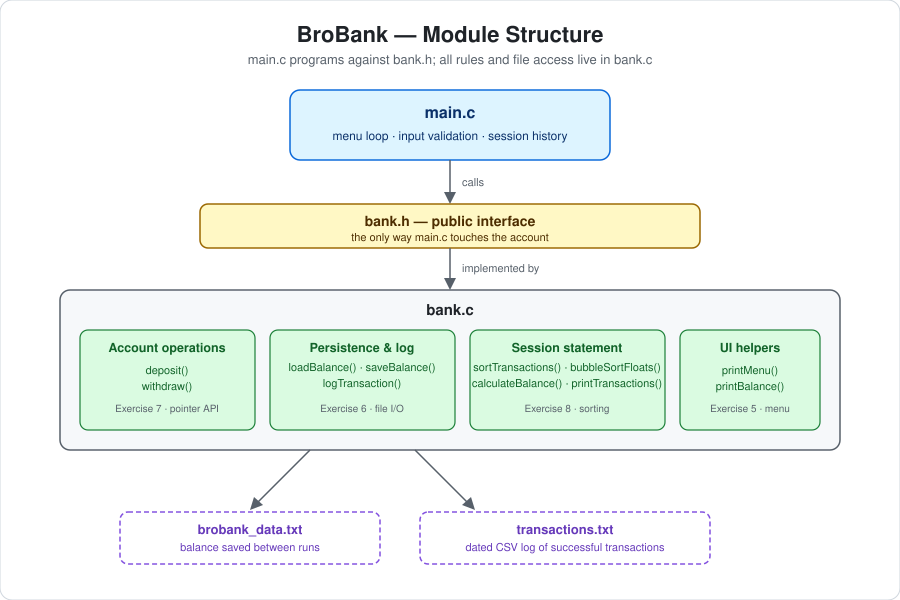

# Diagram or Visualization

## Diagram Explanation

**BroBank module diagram** — shows how the banking application is layered:
`main.c` handles only the menu loop, input validation, and the session
history, and it reaches the account exclusively through the `bank.h`
interface. `bank.c` implements that interface in four sections (account
operations, persistence and logging, the sorted session statement, and
display helpers), and only the persistence functions touch the two data
files. The labels note which course exercise each section originated from,
matching the project structure described in
[`../03-brobank/README.md`](../03-brobank/README.md).

## Diagram Link

